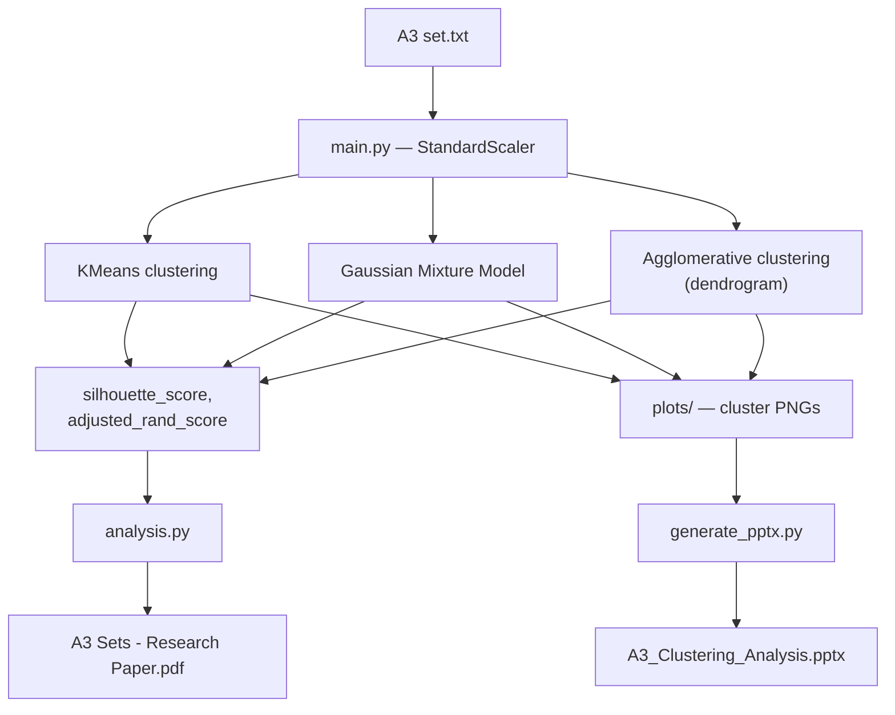

# A3 Clustering Analysis

Unsupervised clustering analysis (KMeans, Gaussian Mixture Models, Agglomerative/hierarchical clustering) applied to the A3 dataset, comparing cluster structure across methods with silhouette scores and adjusted Rand index, and generating a presentation deck of results.

## Architecture



## Outputs

- `01_kmeans_clusters.png`, `02_gmm_clusters.png`, `03_agglomerative_clusters.png` — cluster visualizations per method
- `A3 Sets - Research Paper.pdf` — written analysis
- `A3_Clustering_Analysis.pptx` — presentation deck (generated by `generate_pptx.py`)

## Running it

```bash
python main.py            # run clustering, produce plots
python analysis.py        # statistical comparison across methods
python generate_pptx.py   # build the presentation deck
```

Requires `numpy`, `pandas`, `matplotlib`, `seaborn`, `scikit-learn`, `scipy`.

## Statistical rigour

Cluster validity is assessed via silhouette score (internal) and adjusted Rand index (external, where ground-truth labels are available), rather than relying on visual inspection alone.
