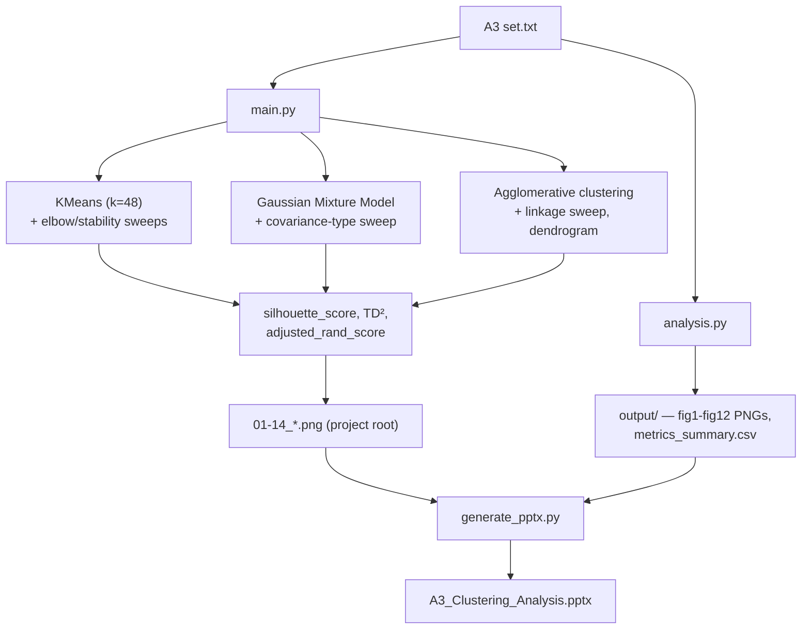

# A3 Clustering Analysis

Unsupervised clustering analysis (KMeans, Gaussian Mixture Models, Agglomerative/hierarchical clustering) applied to the A3 dataset, comparing cluster structure across methods with silhouette scores, TD² (total squared distance), adjusted Rand index stability, and generating a presentation deck of results.

## Architecture



## Outputs

- `01_kmeans_clusters.png` … `14_agg_linkage_metrics.png` — cluster visualizations, elbow/stability sweeps, and metric comparisons produced by `main.py` (root directory)
- `output/` — a second, independently generated figure set (`fig1_raw_data.png` … `fig12_comparison_grid.png`, `metrics_summary.csv`) produced by `analysis.py`
- `A3 Sets - Research Paper.pdf` — written analysis
- `A3_Clustering_Analysis.pptx` — presentation deck (generated by `generate_pptx.py`)

## Running it

```bash
python main.py            # run clustering, produce 01-14_*.png in project root
python analysis.py        # independent statistical comparison, writes to output/
python generate_pptx.py   # build the presentation deck
```

Requires `numpy`, `pandas`, `matplotlib`, `seaborn`, `scikit-learn`, `scipy`, `python-pptx`.

`main.py` writes plots relative to its own file location (`Path(__file__).parent`), not a hardcoded path — safe to run from a clone in any location.

## Statistical rigour

Cluster validity is assessed via silhouette score (internal), TD² (compactness), and adjusted Rand index stability across repeated random-state runs — not visual inspection alone.
